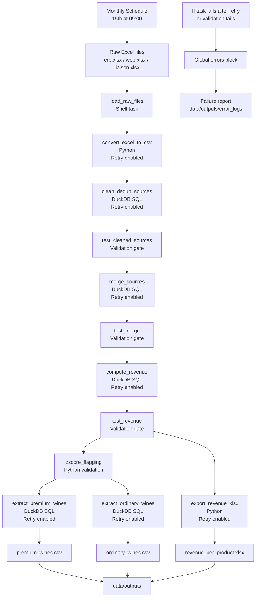

# BottleNeck Data Workflow Orchestration Pipeline

## 1. Project Overview

This project was completed as part of the OpenClassrooms Data Engineer project:

**Mettez en place un pipeline d'orchestration des flux**

The objective is to automate and orchestrate BottleNeck’s monthly data transformation workflow using **Kestra**, **DuckDB**, **Python**, and **Docker**.

BottleNeck is a wine merchant that manages product and sales data across several systems:

* an **ERP system** containing internal product, price, and stock data;
* a **CMS / Web system** containing online product and sales data;
* a **liaison file** used to reconcile ERP products with CMS/Web products.

The pipeline reproduces and industrializes the manual analysis previously performed by the Data Analyst. It cleans the data, reconciles the systems, calculates revenue, detects premium wines using the z-score method, validates the results, and generates the final business deliverables.

---

## 2. Business Objectives

The workflow must generate the following outputs:

1. An Excel revenue report containing:

   * revenue by product;
   * total revenue.

2. A CSV extraction of premium wines.

3. A CSV extraction of ordinary wines.

4. A scheduled execution every month on the 15th at 09:00.

5. Validation tests to ensure the pipeline produces reliable results.

6. Error handling in case a task fails during execution.

7. Retry logic for technical processing tasks that may fail temporarily.

---

## 3. Technologies Used

| Tool       | Role                                                                        |
| ---------- | --------------------------------------------------------------------------- |
| Kestra     | Workflow orchestration, scheduling, monitoring, retries, and error handling |
| DuckDB     | SQL transformations, joins, revenue calculation, tests, and CSV exports     |
| Python     | Excel conversion, z-score calculation, and Excel report generation          |
| Pandas     | Data manipulation inside Python scripts                                     |
| OpenPyXL   | Excel file generation                                                       |
| Docker     | Reproducible local execution environment                                    |
| PostgreSQL | Kestra metadata database                                                    |

---

## 4. Project Structure

```text
bottleneck_kestra_project/
│
├── data/
│   ├── raw/
│   │   ├── erp.xlsx
│   │   ├── web.xlsx
│   │   └── liaison.xlsx
│   │
│   ├── processed/
│   │   ├── erp_clean.csv
│   │   ├── web_clean.csv
│   │   ├── liaison_clean.csv
│   │   ├── merged.csv
│   │   ├── merged_with_revenue.csv
│   │   ├── revenue_per_product.csv
│   │   └── premium_flagged.csv
│   │
│   └── outputs/
│       ├── revenue_per_product.xlsx
│       ├── premium_wines.csv
│       ├── ordinary_wines.csv
│       └── error_logs/
│
├── flows/
│   └── bottleneck_workflow.yaml
│
├── scripts/
│   ├── load_raw_files.sh
│   ├── convert_excel_to_csv.py
│   ├── zscore_flagging.py
│   └── export_revenue_xlsx.py
│
├── sql/
│   ├── 01_clean_dedup_sources.sql
│   ├── 02_test_cleaned_sources.sql
│   ├── 03_merge_sources.sql
│   ├── 04_test_merge.sql
│   ├── 05_compute_revenue.sql
│   ├── 06_test_revenue.sql
│   ├── 07_extract_premium_wines.sql
│   └── 08_extract_ordinary_wines.sql
│
├── docs/
│   ├── diagram.drawio
│   ├── presentation.pptx
│   └── auto_evaluation.pdf
│
├── Dockerfile
├── docker-compose.yml
└── README.md
```

---

## 5. Architecture Choice

The project uses a clear separation of responsibilities:

```text
Kestra = orchestration
DuckDB = SQL transformations and tests
Python = Excel conversion, z-score calculation, Excel export
Docker = reproducible execution environment
```

Kestra is used as an **orchestration tool**, not as a data processing engine. The actual transformations are executed by DuckDB and Python scripts.

The final version uses a **shared mounted folder approach** for Docker-based Python tasks.

This means that the Python task containers can directly access:

```text
/app/data
/app/scripts
```

As a result, Python scripts can read intermediate files from:

```text
/app/data/processed/
```

and write final outputs directly to:

```text
/app/data/outputs/
```

This avoids unnecessary bridge/expose tasks and makes the Kestra workflow shorter, clearer, and easier to demonstrate.

---

## 6. Workflow Summary

The Kestra workflow follows these main steps:

```text
1. Load raw Excel files
2. Convert Excel files to CSV
3. Clean and deduplicate ERP, Web, and Liaison data
4. Test cleaned source datasets
5. Merge ERP, Liaison, and Web data
6. Test merged dataset
7. Compute revenue and create the revenue report CSV
8. Test revenue consistency
9. Detect premium wines using z-score
10. Extract premium wines
11. Extract ordinary wines
12. Export the revenue report to Excel
13. Generate a failure report if the workflow fails
```

The workflow also includes retries on selected technical processing tasks.

---

## 7. Workflow Diagram

The following diagram summarizes the main orchestration logic implemented in Kestra:



---

## 8. Source Files

The workflow starts from three Excel files:

| File           | Description                                                                |
| -------------- | -------------------------------------------------------------------------- |
| `erp.xlsx`     | Internal ERP product data: product ID, price, stock quantity, stock status |
| `web.xlsx`     | CMS/Web product data: SKU, product title, total sales, URL                 |
| `liaison.xlsx` | Mapping file between ERP `product_id` and CMS/Web `sku`                    |

The liaison file is required because the ERP and CMS systems use different product identifiers.

The merge logic is:

```text
ERP.product_id = Liaison.product_id
Liaison.id_web = Web.sku
```

---

## 9. Data Cleaning and Deduplication

The cleaning phase is performed with DuckDB SQL.

### ERP cleaning

The ERP dataset is cleaned by:

* removing rows where `product_id` is missing;
* removing duplicate rows.

Expected result:

```text
825 rows
```

### Web cleaning

The Web dataset is cleaned by:

* removing rows where `sku` is missing;
* deduplicating by `sku`;
* keeping one valid row per product.

Expected result:

```text
714 rows
```

### Liaison cleaning

The liaison dataset is cleaned by:

* removing duplicate rows;
* keeping all ERP product mappings, including rows that may not have a corresponding web product.

Expected result:

```text
825 rows
```

The workflow does not force `liaison.id_web` to be non-null during source cleaning because some ERP products may not have an online CMS/Web equivalent. Join consistency is checked later after the merge.

---

## 10. Merge Logic

The cleaned ERP, Web, and Liaison datasets are merged using an inner join.

The merge logic is:

```text
ERP.product_id = Liaison.product_id
Liaison.id_web = Web.sku
```

Only products that exist in the required reconciled ERP/Web scope are kept.

Expected merged result:

```text
714 rows
```

This means that the revenue calculation is performed only on products that have both:

* internal ERP product information;
* matching CMS/Web sales information.

The merge consistency is validated by a dedicated test task checking that the merged file contains the expected number of rows.

---

## 11. Revenue Calculation

Revenue is calculated with the following formula:

```text
revenue = price × total_sales
```

The workflow creates:

```text
data/processed/merged_with_revenue.csv
data/processed/revenue_per_product.csv
```

The `revenue_per_product.csv` file contains the product-level business report with the following columns:

```text
product_id
sku
post_title
total_sales
revenue
```

The expected total revenue is:

```text
70,568.60 €
```

This value is validated by a dedicated Kestra test task.

---

## 12. Premium Wine Detection

Premium wines are detected using the z-score method applied to wine prices.

Formula:

```text
z_score = (price - average_price) / standard_deviation_price
```

Business rule:

```text
premium wine = z_score > 2
ordinary wine = z_score <= 2
```

The Python script creates:

```text
data/processed/premium_flagged.csv
```

This file contains all products with two additional columns:

```text
z_score
is_vintage
```

Expected result:

```text
30 premium wines
```

The workflow validates this result inside the z-score Python script by checking that the number of detected premium wines matches Stéphane’s reference result.

If the number of premium wines is different from 30, the Python assertion fails and Kestra stops the workflow.

---

## 13. Final Outputs

The final business deliverables are saved in:

```text
data/outputs/
```

Expected files:

```text
revenue_per_product.xlsx
premium_wines.csv
ordinary_wines.csv
```

### `revenue_per_product.xlsx`

Contains:

* one sheet with revenue by product;
* one summary sheet with total revenue.

### `premium_wines.csv`

Contains all wines where:

```text
z_score > 2
```

### `ordinary_wines.csv`

Contains all wines where:

```text
z_score <= 2
```

---

## 14. Data Quality Tests

The workflow includes validation tests at key stages.

The tests are implemented as SQL or Python validation tasks and act as **quality gates**. If one test fails, the workflow stops and the global error handler is triggered.

| Stage           | Test                          | Expected Result |
| --------------- | ----------------------------- | --------------- |
| Cleaned ERP     | Row count                     | 825 rows        |
| Cleaned Web     | Row count                     | 714 rows        |
| Cleaned Liaison | Row count                     | 825 rows        |
| Cleaned ERP     | Missing `product_id` values   | 0               |
| Cleaned Web     | Missing `sku` values          | 0               |
| Cleaned Liaison | Missing `product_id` values   | 0               |
| Cleaned ERP     | Duplicate `product_id` values | 0               |
| Cleaned Web     | Duplicate `sku` values        | 0               |
| Cleaned Liaison | Duplicate `product_id` values | 0               |
| Merge           | Merged dataset row count      | 714 rows        |
| Revenue         | Revenue report row count      | 714 rows        |
| Revenue         | Missing revenue values        | 0               |
| Revenue         | Total revenue                 | 70,568.60 €     |
| Z-score         | Premium wine count            | 30 wines        |

### Source quality validation

The `02_test_cleaned_sources.sql` task validates:

```text
- expected row counts for ERP, Web, and Liaison files;
- absence of missing primary/business keys;
- absence of duplicate primary/business keys.
```

### Merge consistency validation

The `04_test_merge.sql` task validates that the final merged dataset contains:

```text
714 rows
```

This confirms that the reconciliation between ERP, Liaison, and Web data is coherent with Stéphane’s reference analysis.

### Revenue validation

The `06_test_revenue.sql` task validates:

```text
- 714 rows in the revenue dataset;
- 714 rows in the revenue report;
- no missing revenue values;
- total revenue = 70,568.60 €.
```

### Z-score validation

The `zscore_flagging.py` script validates:

```text
- z-score calculation on wine prices;
- premium wine classification using z_score > 2;
- expected number of premium wines = 30.
```

---

## 15. Scheduling

The workflow is scheduled to run every month on the 15th at 09:00.

Kestra trigger:

```yaml
triggers:
  - id: monthly_schedule
    type: io.kestra.plugin.core.trigger.Schedule
    cron: "0 9 15 * *"
    timezone: Europe/Paris
```

Cron explanation:

```text
0 9 15 * * = every 15th day of the month at 09:00
```

---

## 16. Error Handling and Retry Strategy

The workflow includes two levels of failure handling:

```text
1. Task-level retries for technical processing tasks
2. A global errors block that writes a failure report if the workflow fails
```

### 16.1 Retry strategy

Retries are applied only to technical processing or output tasks.

Retry-enabled tasks include:

```text
convert_excel_to_csv
clean_dedup_sources
merge_sources
compute_revenue
extract_premium_wines
extract_ordinary_wines
export_revenue_xlsx
```

Each of these tasks uses the following retry strategy:

```yaml
retry:
  type: constant
  maxAttempts: 3
  interval: PT30S
  warningOnRetry: true
```

This means:

```text
- Kestra can retry the task up to 3 times.
- There is a 30-second delay between attempts.
- Retries are marked as warnings.
```

This strategy is useful for temporary technical issues, such as:

```text
- temporary Docker container startup issues;
- temporary file access problems;
- temporary DuckDB execution issues;
- temporary output writing issues.
```

### 16.2 Validation tasks are not retried

Validation tasks are intentionally not retried.

These tasks include:

```text
test_cleaned_sources
test_merge
test_revenue
zscore_flagging
```

The reason is that validation failures usually indicate a real data quality or business rule problem.

For example:

```text
- wrong row count;
- duplicate keys;
- missing business keys;
- incorrect total revenue;
- unexpected number of premium wines.
```

Retrying these tasks would not normally solve the issue. Therefore, if a validation task fails, the workflow stops immediately and the global error handler is triggered.

### 16.3 Global error handler

The workflow includes a global `errors:` block.

If a task fails after retries, or if a validation task fails:

1. Kestra stops the workflow.
2. The global error handler runs.
3. A failure report is created in:

```text
data/outputs/error_logs/
```

The report contains:

* flow ID;
* namespace;
* execution ID;
* execution start date;
* instruction to inspect Kestra logs.

This provides a simple and demonstrable failure-handling mechanism.

In a production environment, this could be extended with:

* Slack alerts;
* email notifications;
* centralized monitoring;
* cloud-based logs;
* dead-letter storage;
* incident management integration.

---

## 17. How to Run the Project

### Step 1 — Start Docker services

From the project root:

```bash
docker compose up -d --build
```

### Step 2 — Open Kestra

Open the Kestra UI:

```text
http://localhost:8080
```

### Step 3 — Run the workflow

In Kestra:

```text
Flows → com.bottleneck → p10_kestra_dataflow_orchestration_pipeline → Execute
```

### Step 4 — Check final outputs

After a successful execution:

```bash
ls -lah data/outputs
```

Expected files:

```text
revenue_per_product.xlsx
premium_wines.csv
ordinary_wines.csv
```

### Step 5 — Check intermediate files

Intermediate technical files are generated in:

```text
data/processed/
```

These files can be used for debugging, validation, and understanding the data lineage.

---

## 18. Important Configuration Note

The final workflow uses Docker volume mounts for Python tasks.

In the Kestra flow, Python Docker tasks mount local folders such as:

```yaml
volumes:
  - /Users/elkihale.n-abualqumboz.mk/Desktop/bottleneck_kestra_project/data:/app/data
  - /Users/elkihale.n-abualqumboz.mk/Desktop/bottleneck_kestra_project/scripts:/app/scripts
```

These absolute paths work on the local development machine used for this project.

If the project is executed on another machine, these absolute paths must be updated to match the local project directory.

Example:

```yaml
volumes:
  - /path/to/bottleneck_kestra_project/data:/app/data
  - /path/to/bottleneck_kestra_project/scripts:/app/scripts
```

The Docker runner volume option must also be enabled in `docker-compose.yml`:

```yaml
plugins:
  configurations:
    - type: io.kestra.plugin.scripts.runner.docker.Docker
      values:
        volume-enabled: true
```

This allows Docker-based Kestra tasks to mount local project folders.

---

## 19. Intermediate vs Final Files

The `data/processed/` folder contains intermediate technical files used by the pipeline:

```text
erp_clean.csv
web_clean.csv
liaison_clean.csv
merged.csv
merged_with_revenue.csv
revenue_per_product.csv
premium_flagged.csv
```

These files are useful for:

* debugging;
* validating row counts;
* understanding data lineage;
* feeding downstream tasks.

The official business deliverables are stored in:

```text
data/outputs/
```

Expected final business deliverables:

```text
revenue_per_product.xlsx
premium_wines.csv
ordinary_wines.csv
```

---

## 20. Deliverables

The submitted project includes:

```text
1. Kestra workflow YAML
2. SQL scripts
3. Python and shell scripts
4. Final output files
5. Draw.io architecture diagram
6. PowerPoint presentation
7. Completed auto-evaluation form
8. README documentation
```

The main deliverables expected by the mission are:

```text
- Diagram of the task workflow in .drawio format
- Kestra workflow in .yaml format
- SQL and Python scripts
- Excel revenue report
- Premium wines CSV extraction
- Ordinary wines CSV extraction
- Presentation support
```

---

## 21. Demonstration Plan

During the defense, the workflow can be demonstrated as follows:

```text
1. Open Kestra UI.
2. Show the workflow topology.
3. Execute the workflow manually.
4. Show the successful execution status.
5. Open task logs showing validation tests passed.
6. Show generated files in data/outputs/.
7. Open the Excel revenue report.
8. Show premium_wines.csv and ordinary_wines.csv.
```

The scheduled trigger can also be shown in the workflow definition:

```text
monthly_schedule = every 15th day of the month at 09:00
```

---

## 22. Possible Improvements

The current project satisfies the mission requirements and is designed for local demonstration.

Possible future improvements include:

```text
- Replace local mounted folders with cloud object storage.
- Add Slack or email alerts for production incidents.
- Store historical monthly reports instead of overwriting outputs.
- Add a dashboard layer for business users.
- Add more detailed data quality reports.
- Add centralized logging and monitoring.
- Add parameterized execution dates.
- Add separate development, test, and production environments.
```

---

## 23. Conclusion

This project demonstrates how to transform a manual data analysis process into an automated and orchestrated data pipeline.

The final solution:

* loads and prepares raw files;
* cleans and deduplicates the source datasets;
* validates missing and duplicate business keys;
* reconciles ERP and CMS/Web data;
* validates merge consistency;
* calculates and validates revenue;
* detects premium wines using a statistical method;
* validates the expected number of premium wines;
* generates final business outputs;
* schedules the workflow monthly;
* retries selected technical processing tasks;
* handles workflow failures with a failure report.

The workflow is reproducible, testable, monitored through Kestra, and ready to be demonstrated during the project defense.
# May-2026-project10-Mettez-en-place-un-pipeline-d-orchestration-des-flux
